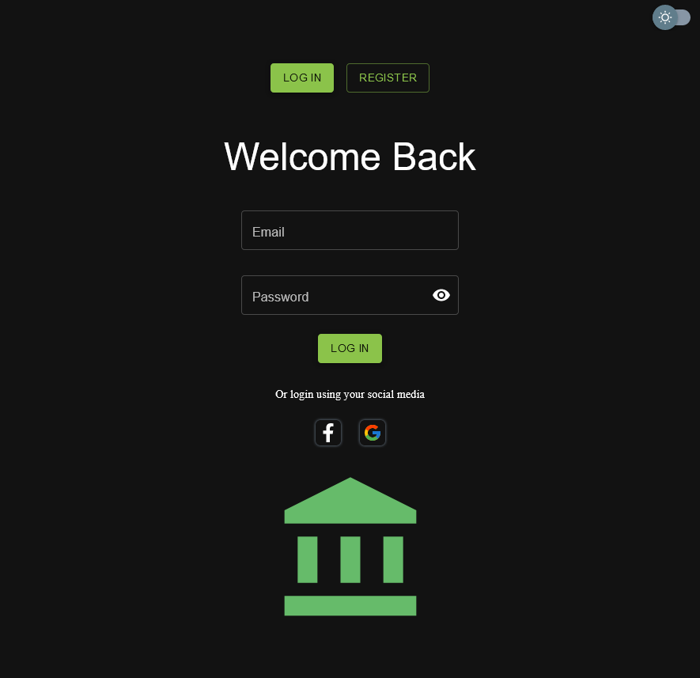
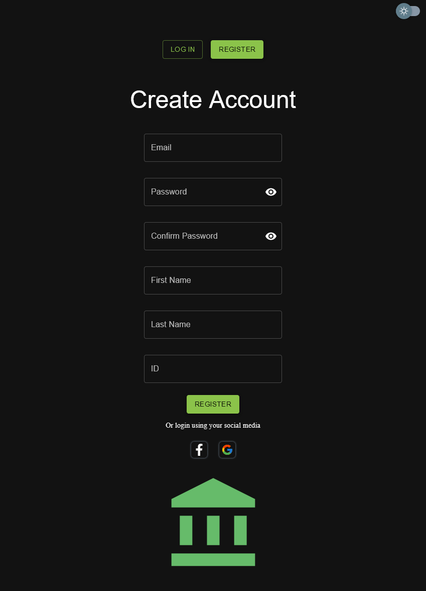
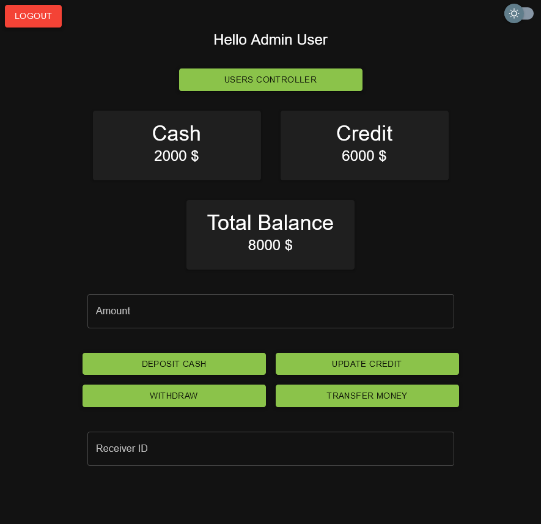
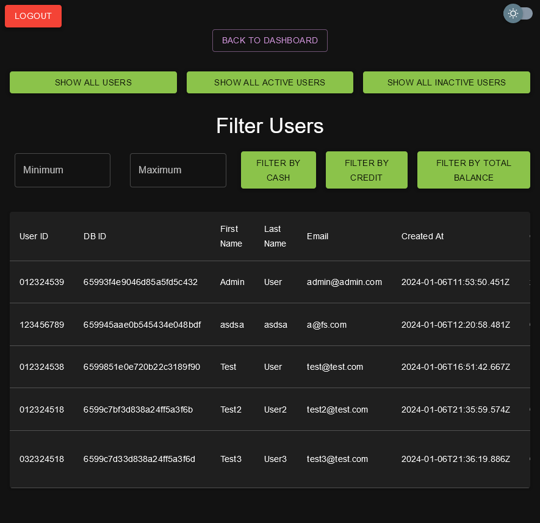
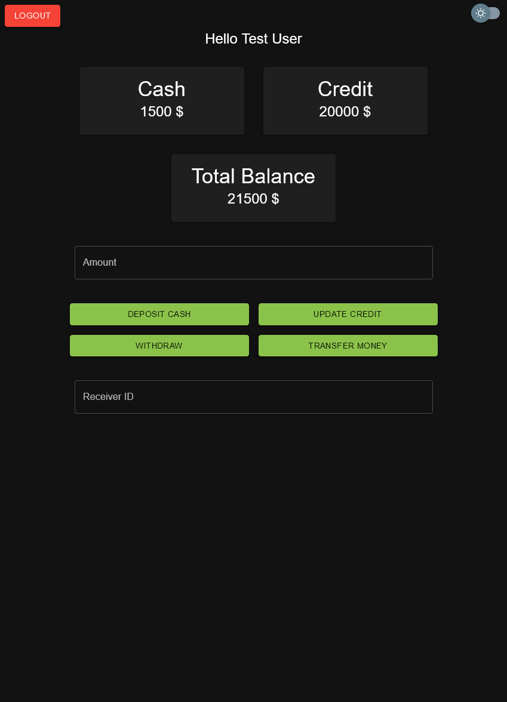

# My Bank Application

Welcome to My Bank Application! This full-stack web application is built with React, React Router DOM, Axios, Material UI, MUI Icons, Express, Mongoose, and MongoDB.

## Link:- https://radiant-moxie-80f7c1.netlify.app/

## Accounts

-   Admin-Account: Admin@admin.com , password:12345678
-   Regular-Account-Active: test@test.com , password:12345678
-   Regular-Account-Inactive: test3@test.com , password:12345678

## Features

-   **Authentication:**

    -   Users can log in and register using email and password.
    -   Sessions are managed using browser Local Storage.

-   **Dashboard:**

    -   Users can view their cash, credit, and total balance.
    -   Users can deposit cash, update credit, withdraw cash, and transfer money to other users using their user IDs.

-   **Admin Users Controller:**

    -   Admins have access to a Users Controller page.
    -   The Users Controller page displays a table with user information.
    -   Admins can change user activation status and delete users.
    -   Admins have option to see all users ,all active users, all inactive users.
        -Admins have the option to filter users by there cash ,credit or total balance by inserting minimum and maximum values.

-   **Light and Dark Mode:**
    -   The application supports both light and dark modes.
    -   Users can toggle between light and dark modes.

## Preview

